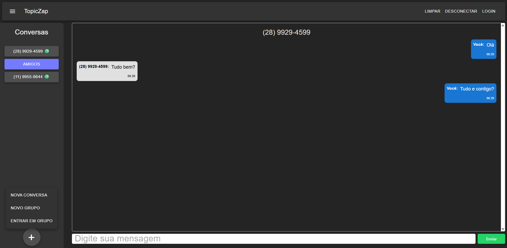
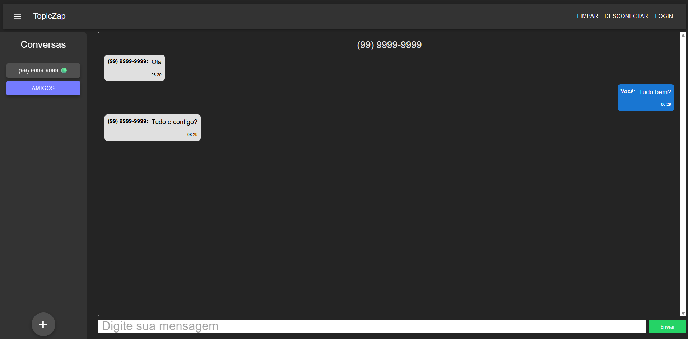
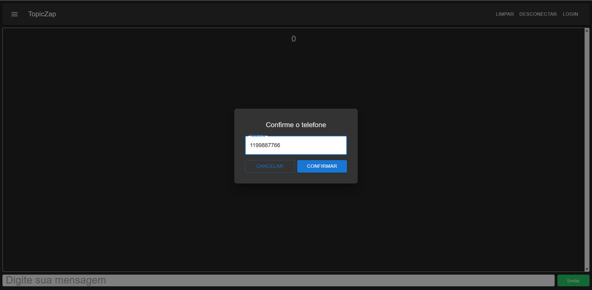
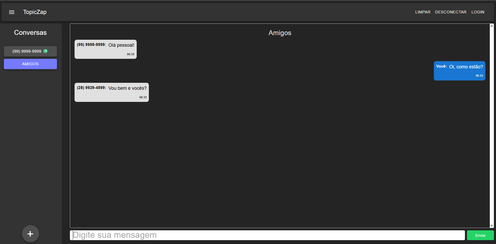
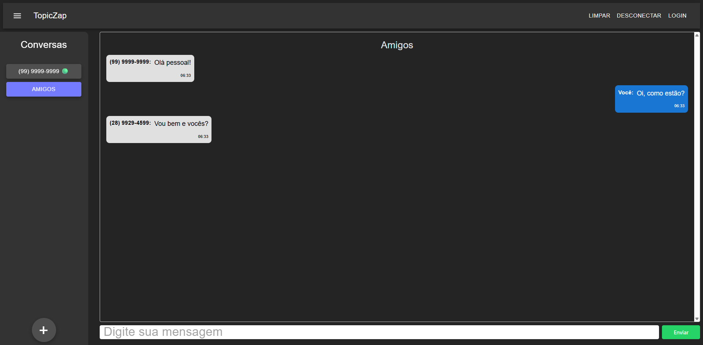

# 💬 Chat MQTT Toticos

<div align="center">


Uma aplicação de chat em tempo real construída com React, Vite e protocolo MQTT, oferecendo comunicação instantânea e segura entre múltiplos usuários.

[Demonstração](#-demonstração) • [Instalação](#-instalação) • [Recursos](#-recursos) • [Configuração](#️-configuração)

</div>

---

## 📸 Demonstração

### Interface Principal

*Interface moderna e intuitiva do chat*

### Chat em Tempo Real

*Mensagens sendo trocadas em tempo real via MQTT*

### Configuração de Conexão

*Tela login com teu número ID*

### Múltiplos Usuários

*Vários usuários conectados simultaneamente*

### Possibilidade de Criar Grupos

*Possibilidade de conversa entre varios usuários em grupos*

### Modo Responsivo
<p align="center">
  
</p>

*Interface adaptada para dispositivos móveis*

---

## 🚀 Tecnologias

Este projeto foi desenvolvido utilizando as seguintes tecnologias:

- **[React](https://reactjs.org/)** - Biblioteca JavaScript para construção de interfaces
- **[Vite](https://vitejs.dev/)** - Build tool ultrarrápido com HMR
- **[TypeScript](https://www.typescriptlang.org/)** - Superset JavaScript com tipagem estática
- **[MQTT Protocol](https://mqtt.org/)** - Protocolo de mensageria leve para IoT
- **[Paho MQTT](https://www.eclipse.org/paho/)** - Cliente JavaScript MQTT
- **[ESLint](https://eslint.org/)** - Ferramenta de linting e formatação

---

## ✨ Recursos

- ✅ **Chat em tempo real** usando protocolo MQTT
- ✅ **Interface responsiva** e moderna
- ✅ **Conexão com brokers** MQTT públicos ou privados
- ✅ **Múltiplos usuários** simultâneos
- ✅ **Baixa latência** na troca de mensagens
- ✅ **Suporte a WebSocket** para comunicação no navegador
- ✅ **Logs de sistema** para debugging
- ✅ **Tipagem completa** com TypeScript

---

## 📋 Pré-requisitos

Antes de começar, certifique-se de ter instalado em sua máquina:

- **Node.js** (versão 16 ou superior)
- **npm** ou **yarn**
- **Broker MQTT** (Mosquitto, HiveMQ, ou broker público)

---

## 🔧 Instalação

### 1️⃣ Clone o repositório

```bash
git clone https://github.com/DavidMezadri/chat-MQQT-Toticos.git
cd chat-MQQT-Toticos
```

### 2️⃣ Instale as dependências

```bash
npm install
```

### 3️⃣ Configure o broker MQTT

Edite as configurações do broker na função `setMyNumberTelephone`:

```typescript
{
  brokerHost: "localhost",
  brokerPort: 9001,
  useSSL: false
}
```

---

## 🎮 Como Usar

### Modo de Desenvolvimento

Execute o servidor de desenvolvimento:

```bash
npm run dev
```

O aplicativo estará disponível em: **http://localhost:5173**

### Build para Produção

```bash
npm run build
```

### Preview da Build

```bash
npm run preview
```

---

## 🏗️ Estrutura do Projeto

```
chat-MQQT-Toticos/
├── 📁 public/              # Arquivos estáticos
├── 📁 src/
│   ├── 📁 components/      # Componentes React
│   ├── 📁 hooks/           # Custom hooks
│   ├── 📁 services/        # Serviços (MQTT client)
│   ├── 📁 styles/          # Arquivos de estilo
│   ├── 📄 App.tsx          # Componente principal
│   └── 📄 main.tsx         # Entry point
├── 📁 docs/
│   └── 📁 images/          # Screenshots da aplicação
├── 📄 package.json
├── 📄 vite.config.ts       # Configuração do Vite
├── 📄 tsconfig.json        # Configuração do TypeScript
├── 📄 eslint.config.js     # Configuração do ESLint
└── 📄 README.md
```

---

## 🔌 Configuração do MQTT

### Opções de Broker

Este projeto suporta diferentes tipos de brokers MQTT:

1. **Mosquitto Local** - Instale e execute localmente
2. **Broker Público** - Use brokers de teste gratuitos
3. **Broker Próprio** - Configure seu servidor MQTT

### Configurando o Mosquitto Localmente

#### 1. Verificar Status do Servidor

```bash
sudo systemctl status mosquitto
```

#### 2. Criar/Editar Arquivo de Configuração

```bash
sudo nano /etc/mosquitto/mosquitto.conf
```

#### 3. Adicionar Configurações

```conf
# Persistência de dados
persistence true
persistence_location /var/lib/mosquitto/

include_dir /etc/mosquitto/conf.d

# Listener MQTT padrão (TCP)
listener 1883
protocol mqtt
allow_anonymous true

# Listener para WebSocket (navegador)
listener 9001
protocol websockets
allow_anonymous true

# Ativar logs
log_dest file /var/log/mosquitto/mosquitto.log
log_type all
```

#### 4. Reiniciar o Serviço

```bash
sudo systemctl restart mosquitto
```

#### 5. Verificar Logs (opcional)

```bash
tail -f /var/log/mosquitto/mosquitto.log
```

---

## 🐳 Docker (Opcional)

O projeto inclui um `Dockerfile` para containerização:

```bash
# Build da imagem
docker build -t chat-mqtt-toticos .

# Executar container
docker run -p 5173:5173 chat-mqtt-toticos
```

---

## 🛠️ Scripts Disponíveis

| Script | Descrição |
|--------|-----------|
| `npm run dev` | Inicia servidor de desenvolvimento |
| `npm run build` | Gera build de produção |
| `npm run preview` | Preview da build de produção |
| `npm run lint` | Executa linting do código |

---

## 📚 Como Adicionar Screenshots

Para adicionar suas próprias capturas de tela:

1. Crie a pasta `docs/images/` na raiz do projeto
2. Adicione suas imagens com os seguintes nomes:
   - `screenshot-main.png` - Tela principal
   - `screenshot-chat.png` - Chat funcionando
   - `screenshot-config.png` - Tela de configuração
   - `screenshot-multi-users.png` - Múltiplos usuários
   - `screenshot-mobile.png` - Versão mobile

3. As imagens serão automaticamente referenciadas no README

---

## 🤝 Contribuindo

Contribuições são sempre bem-vindas! Para contribuir:

1. Faça um fork do projeto
2. Crie uma branch para sua feature (`git checkout -b feature/MinhaFeature`)
3. Commit suas mudanças (`git commit -m 'Adiciona MinhaFeature'`)
4. Push para a branch (`git push origin feature/MinhaFeature`)
5. Abra um Pull Request

---

## 📝 Licença

Este projeto está sob a licença MIT. Veja o arquivo [LICENSE](LICENSE) para mais detalhes.

---

## 👥 Autor

<table>
  <tr>
    <td align="center">
      <a href="https://github.com/DavidMezadri">
        <br />
        <sub><b>David Fambre Mezadri</b></sub>
      </a>
    </td>
  </tr>
</table>

---

## 📞 Contato

Se você tiver alguma dúvida ou sugestão, sinta-se à vontade para abrir uma [issue](https://github.com/DavidMezadri/chat-MQQT-Toticos/issues) ou entrar em contato.

---

## 🌟 Mostre seu Apoio

Se este projeto foi útil para você, considere dar uma ⭐ no repositório!

---

<div align="center">

Feito com ❤️ por [David Mezadri](https://github.com/DavidMezadri)

</div>
